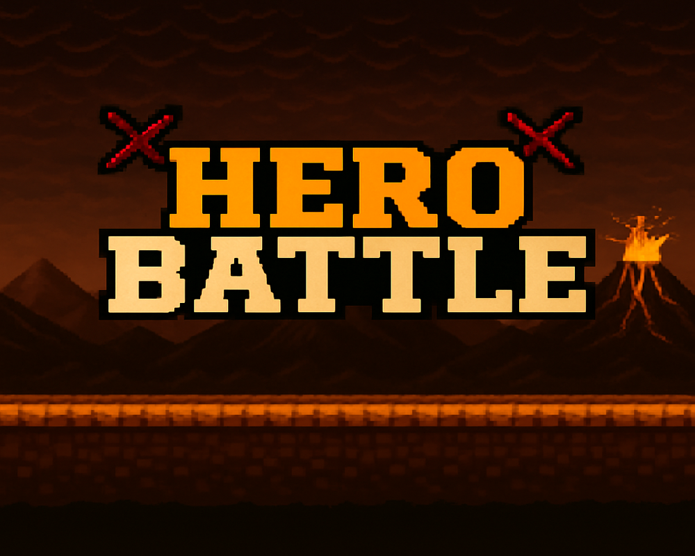

# ⚔️ Hero Battle

> A 2D local-multiplayer fighting game built with **Python** and **Pygame**, featuring pixel-art heroes, sprite animations, and round-based combat for two players on the same keyboard.

---

## 📖 Description

**Hero Battle** is a 2D fighting game where two players face off on the same device. Each player selects a hero — **Goblin**, **Skeleton**, or **Mushroom** — each with unique HP and attack stats, then battles in a volcanic arena. Players move, jump, and attack in real time until one hero's health bar is depleted and a victory screen declares the winner. The game flows through three states (Main Menu → Hero Selection → Battle) with smooth fade transitions, animated sprites (idle / walk / attack), and interactive UI built entirely with Pygame.

---

## 📂 Project Structure

```
Hero Battle/
├── main.py              # Main game loop & state rendering
├── settings.py          # Window, fonts, colors, physics & timing config
├── state_manager.py     # Game state machine (menu / select / battle) + fade transitions
├── heros.py             # Hero class, hero data (HP/attack), player states & hero selection
├── battle.py            # Battle logic, animations, movement, collisions & damage
├── hero_card.py         # Hero selection cards (HeroCard class)
├── button.py            # Reusable Button UI component
├── victory.py           # Victory screen (Replay / Main Menu buttons)
├── cut.py               # Helper / utility script
│
├── assets/
│   ├── menu_background.png
│   ├── select_background.png
│   ├── figh_background.png
│   ├── cards/                 # Hero selection cards (goblin / mushroom / skeleton)
│   ├── fonts/                 # press_start.ttf (retro pixel font)
│   └── sprites/               # Animated frames per hero
│       ├── goblin/   (idle / walk / attack)
│       ├── skeleton/ (idle / walk / attack)
│       └── mushroom/ (idle / walk / attack)
│
└── screenshots/         # Game preview images
```

---

## ✨ Key Features

- 🎮 **Local 2-Player Combat** — two players battle on a single keyboard.
- 🦸 **Three Playable Heroes** — Goblin, Skeleton, and Mushroom, each with distinct HP and attack values.
- 🎞️ **Sprite Animations** — smooth idle, walk, and attack animations for every hero.
- 🕹️ **Full Physics** — jumping with gravity, movement, and attack cooldowns.
- ❤️ **Health Bars & Damage System** — real-time health tracking with hitbox-based collision detection.
- 🖼️ **State Machine** — clean transitions between Main Menu, Hero Selection, and Battle screens with fade effects.
- 🏆 **Victory Screen** — displays the winner with **Replay** and **Main Menu** options.
- 🎨 **Retro Pixel-Art Style** — custom backgrounds, hero cards, and the *Press Start* pixel font.

### 🎯 Controls

| Action | Player 1 | Player 2 |
|--------|----------|----------|
| Move   | `← / →`  | `A / D`  |
| Jump   | `↑`      | `W`      |
| Attack | `Enter`  | `Space`  |

---

## 🖼️ Screenshots

### Main Menu


### Hero Selection


### Battle Arena


---

## 🚀 Getting Started

```bash
# 1. Install dependency
pip install pygame

# 2. Run the game
cd "Hero Battle"
python main.py
```

---

*Built with ❤️ using Python & Pygame*
